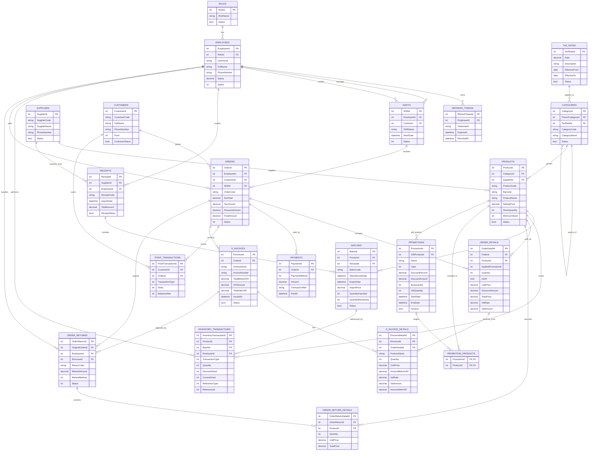

# AI ERD Drawing Guide for MiniMart

Muc dich: dung file nay lam prompt/brief cho AI ve ERD theo he thong hien tai. Nguon su that nen uu tien la EF Core model hien tai trong `backend/MiniMart/Models/`, cau hinh quan he trong `backend/MiniMart/Data/MiniMartDbContext.cs`, va snapshot `backend/MiniMart/Migrations/MiniMartDbContextModelSnapshot.cs`.

> Luu y quan trong: tai source hien tai khong co `Store` entity, du `docs/minimartdb-implementation-phases.md` co nhac den Stores nhu mot ke hoach/phase. Khi ve ERD hien tai, khong ve bang `Stores` neu chua xac minh no da ton tai trong model/snapshot.

## Prompt Mau Cho AI Ve ERD

Hay ve ERD cho he thong MiniMart Management dua tren cac entity EF Core hien tai. Day la backend ASP.NET 8 Web API dung SQL Server va EF Core. Ve theo nhom domain: Auth/Staff, Catalog/Inventory, Sales, Payment/Points/Returns, Invoice/VAT, Promotions.

Yeu cau khi ve:

- Chi ve cac bang/entity dang ton tai trong model hien tai.
- Hien thi primary key, foreign key, va cac field nghiep vu quan trong.
- Dung cardinality ro rang: one-to-many, optional one-to-many, many-to-many qua join table.
- Khong ve DTO, repository, service, controller.
- Khong ve `Store/Stores` vi source hien tai chua co entity nay.
- `InventoryTransactions.ReferenceType` va `ReferenceId` la polymorphic reference, khong phai FK vat ly; ve nhu field ghi chu, khong noi FK cung.
- `OrderDetail.AppliedPromotionId` dang la field nullable nhung chua duoc cau hinh relationship voi `Promotion`; neu ve thi danh dau la "logical reference / not configured FK".
- `Orders.ShiftId` la nullable shadow FK trong EF snapshot do `Shift.Orders`; neu can ERD vat ly theo database, ve `Shift 1 -> 0..n Order` qua `Orders.ShiftId`.

## Entity Groups

### Auth and Staff

- `Roles`
  - PK: `RoleId`
  - Fields: `RoleName`, `Description`, `Status`
- `Employees`
  - PK: `EmployeeId`
  - FK: `RoleId -> Roles.RoleId`
  - Fields: `FullName`, `Gender`, `DateOfBirth`, `PhoneNumber`, `Email`, `Address`, `Username`, `PasswordHash`, `FailedLoginAttempts`, `LockoutEnd`, `Salary`, `HireDate`, `Avatar`, `Status`
- `RefreshTokens`
  - PK: `RefreshTokenId`
  - FK: `EmployeeId -> Employees.EmployeeId`
  - Fields: `TokenHash`, `ExpiresAt`, `RevokedAt`
- `Shifts`
  - PK: `ShiftId`
  - FK: `EmployeeId -> Employees.EmployeeId` as manager/owner
  - FK nullable: `CashierId -> Employees.EmployeeId`
  - Fields: `ShiftName`, `StartTime`, `EndTime`, `WorkDate`, `StartCash`, `EndCash`, `Revenue`, `Status`, `Note`, `ClosedAt`

Relationships:

- `Role 1 -> many Employee`
- `Employee 1 -> many RefreshToken`
- `Employee 1 -> many Shift` via `EmployeeId`
- `Employee 0..1 -> many Shift` via `CashierId`
- `Shift 1 -> many Order` via nullable shadow `Orders.ShiftId` in EF snapshot

### Catalog, Supplier, VAT

- `TaxRates`
  - PK: `TaxRateId`
  - Fields: `Rate`, `Description`, `EffectiveFrom`, `EffectiveTo`, `Status`
- `Categories`
  - PK: `CategoryId`
  - FK nullable: `ParentCategoryId -> Categories.CategoryId`
  - FK: `TaxRateId -> TaxRates.TaxRateId`
  - Fields: `CategoryCode`, `CategoryName`, `Description`, `Status`, `DisplayOrder`
- `Suppliers`
  - PK: `SupplierId`
  - Fields: `SupplierCode`, `SupplierName`, `ContactPerson`, `PhoneNumber`, `Email`, `Address`, `TaxCode`, `BankAccount`, `BankName`, `Description`, `Status`
- `Products`
  - PK: `ProductId`
  - FK: `CategoryId -> Categories.CategoryId`
  - FK: `SupplierId -> Suppliers.SupplierId`
  - Fields: `ProductCode`, `Barcode`, `ProductName`, `SellingPrice`, `StockQuantity`, `MinimumStock`, `Description`, `ImageUrl`, `Status`

Relationships:

- `TaxRate 1 -> many Category`
- `Category 0..1 -> many Category` self-reference for parent/child category
- `Category 1 -> many Product`
- `Supplier 1 -> many Product`

### Inventory and Receiving

- `Receipts`
  - PK: `ReceiptId`
  - FK: `SupplierId -> Suppliers.SupplierId`
  - FK: `EmployeeId -> Employees.EmployeeId`
  - Fields: `ReceiptCode`, `ImportDate`, `TotalAmount`, `PaidAmount`, `DebtAmount`, `ReceiptStatus`, `Note`
- `Batches`
  - PK: `BatchId`
  - FK: `ProductId -> Products.ProductId`
  - FK: `ReceiptId -> Receipts.ReceiptId`
  - Fields: `BatchCode`, `ManufactureDate`, `ExpiryDate`, `ImportPrice`, `QuantityImported`, `QuantityRemaining`, `Quantity`, `TotalPrice`, `IsDeleted`, `Status`
- `InventoryTransactions`
  - PK: `InventoryTransactionId`
  - FK: `ProductId -> Products.ProductId`
  - FK nullable: `BatchId -> Batches.BatchId`
  - FK: `EmployeeId -> Employees.EmployeeId`
  - Fields: `TransactionType`, `Quantity`, `PreviousStock`, `CurrentStock`, `ReferenceType`, `ReferenceId`, `Note`

Relationships:

- `Supplier 1 -> many Receipt`
- `Employee 1 -> many Receipt`
- `Receipt 1 -> many Batch`
- `Product 1 -> many Batch`
- `Product 1 -> many InventoryTransaction`
- `Batch 0..1 -> many InventoryTransaction`
- `Employee 1 -> many InventoryTransaction`

### Sales

- `Customers`
  - PK: `CustomerId`
  - Fields: `CustomerCode`, `FullName`, `PhoneNumber`, `Email`, `Address`, `Point`, `CustomerStatus`
- `Orders`
  - PK: `OrderId`
  - FK: `EmployeeId -> Employees.EmployeeId`
  - FK nullable: `CustomerId -> Customers.CustomerId`
  - FK nullable, shadow in snapshot: `ShiftId -> Shifts.ShiftId`
  - Fields: `OrderCode`, `SubTotal`, `TaxAmount`, `DiscountAmount`, `FinalAmount`, `PaidAmount`, `ChangeAmount`, `Status`, `Note`
- `OrderDetails`
  - PK: `OrderDetailId`
  - FK: `OrderId -> Orders.OrderId`
  - FK: `ProductId -> Products.ProductId`
  - Logical nullable reference: `AppliedPromotionId`
  - Fields: `Quantity`, `IsGift`, `UnitPrice`, `DiscountAmount`, `TotalPrice`, `VatRate`, `VatAmount`

Relationships:

- `Employee 1 -> many Order`
- `Customer 0..1 -> many Order`
- `Shift 0..1 -> many Order`
- `Order 1 -> many OrderDetail`
- `Product 1 -> many OrderDetail`

### Payments, Points, Returns

- `Payments`
  - PK: `PaymentId`
  - FK: `OrderId -> Orders.OrderId`
  - Fields: `PaymentMethod`, `Amount`, `TransactionRef`, `PaidAt`
- `PointTransactions`
  - PK: `PointTransactionId`
  - FK: `CustomerId -> Customers.CustomerId`
  - FK nullable: `OrderId -> Orders.OrderId`
  - Fields: `TransactionType`, `Delta`, `BalanceAfter`, `Note`
- `OrderReturns`
  - PK: `OrderReturnId`
  - FK: `OriginalOrderId -> Orders.OrderId`
  - FK: `EmployeeId -> Employees.EmployeeId`
  - FK nullable: `EInvoiceId -> EInvoices.EInvoiceId`
  - Fields: `ReturnCode`, `Reason`, `RefundAmount`, `RefundMethod`, `Status`
- `OrderReturnDetails`
  - PK: `OrderReturnDetailId`
  - FK: `OrderReturnId -> OrderReturns.OrderReturnId`
  - FK: `ProductId -> Products.ProductId`
  - Fields: `Quantity`, `UnitPrice`, `TotalPrice`

Relationships:

- `Order 1 -> many Payment`
- `Customer 1 -> many PointTransaction`
- `Order 0..1 -> many PointTransaction`
- `Order 1 -> many OrderReturn` through `OriginalOrderId`
- `Employee 1 -> many OrderReturn`
- `EInvoice 0..1 -> many OrderReturn`
- `OrderReturn 1 -> many OrderReturnDetail`
- `Product 1 -> many OrderReturnDetail`

### E-Invoice and VAT Snapshot

- `EInvoices`
  - PK: `EInvoiceId`
  - FK: `OrderId -> Orders.OrderId`
  - Fields: `InvoiceSerial`, `InvoiceNumber`, `BuyerTaxCode`, `BuyerName`, `BuyerAddress`, `TotalBeforeVAT`, `VATAmount`, `TotalAfterVAT`, `GDTAuthCode`, `XMLContent`, `IssuedAt`, `Status`
- `EInvoiceDetails`
  - PK: `EInvoiceDetailId`
  - FK: `EInvoiceId -> EInvoices.EInvoiceId`
  - FK: `OrderDetailId -> OrderDetails.OrderDetailId`
  - Fields: `ProductName`, `Unit`, `Quantity`, `UnitPrice`, `DiscountAmount`, `AmountBeforeVAT`, `VatRate`, `VatAmount`, `AmountAfterVAT`

Relationships:

- `Order 1 -> many EInvoice`
- `EInvoice 1 -> many EInvoiceDetail`
- `OrderDetail 1 -> many EInvoiceDetail`

### Promotions

- `Promotions`
  - PK: `PromotionId`
  - FK nullable: `GiftProductId -> Products.ProductId`
  - Fields: `Name`, `Description`, `Type`, `DiscountPercent`, `DiscountAmount`, `BuyQuantity`, `GiftQuantity`, `StartDate`, `EndDate`, `IsActive`
- `PromotionProducts`
  - Composite PK: `(PromotionId, ProductId)`
  - FK: `PromotionId -> Promotions.PromotionId`
  - FK: `ProductId -> Products.ProductId`

Relationships:

- `Promotion many-to-many Product` through `PromotionProducts`
- `Product 0..1 -> many Promotion` as gift product through nullable `Promotions.GiftProductId`

## Mermaid ERD Starter

Use this as a first pass. If the drawing tool supports richer notation, expand fields and split by domain group.

## Checklist Kiem Tra Sau Khi AI Ve

- Co dung 22 entity hien tai: `Role`, `Employee`, `RefreshToken`, `Shift`, `Customer`, `Supplier`, `TaxRate`, `Category`, `Product`, `Receipt`, `Batch`, `InventoryTransaction`, `Order`, `OrderDetail`, `Payment`, `PointTransaction`, `EInvoice`, `EInvoiceDetail`, `OrderReturn`, `OrderReturnDetail`, `Promotion`, `PromotionProduct`.
- Khong co `Store` neu chua cap nhat source.
- `PromotionProduct` la join table co composite key `(PromotionId, ProductId)`.
- `Category` co self-reference qua `ParentCategoryId`.
- `OrderReturn.OriginalOrderId` tro ve `Orders.OrderId`, khong tao bang `Return`.
- `EInvoiceDetail` noi ca `EInvoice` va `OrderDetail`.
- `InventoryTransaction.ReferenceId` khong duoc ve nhu FK cung.
- Nullable relationships duoc the hien dung: `CustomerId`, `CashierId`, `BatchId`, `OrderId` trong `PointTransaction`, `EInvoiceId`, `GiftProductId`, `ParentCategoryId`, va shadow `ShiftId`.
