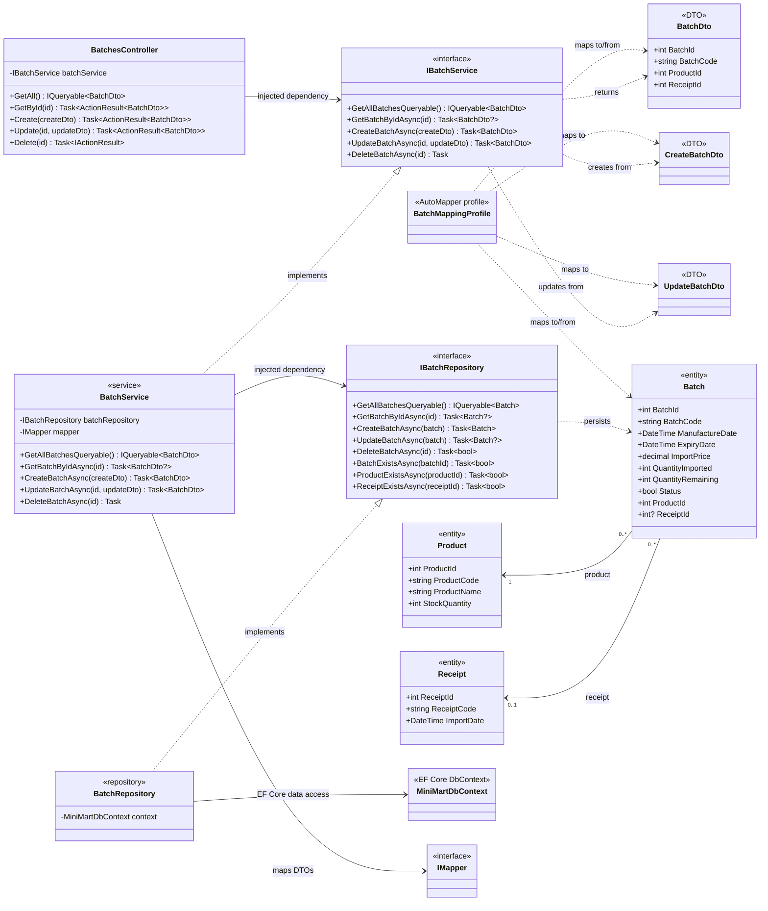

# Batch CRUD class diagram

Scope: the ASP.NET Core Batch REST API at `api/batches` and its CRUD dependencies. Receipt completion, stock counts, and inventory movements are intentionally excluded.

## Diagram notes

- `BatchesController` authorizes reads for `AnyEmployee` and mutations for `ManagerUp`; it delegates all CRUD work to `IBatchService`.
- `BatchService` validates referenced product and receipt IDs, uses AutoMapper for DTO conversion, and delegates persistence to `IBatchRepository`.
- `BatchRepository` queries non-deleted batches and implements deletion as a soft delete by setting `Batch.IsDeleted`.
- `Batch.ProductId` is required. `Batch.ReceiptId` is nullable in the entity, so the `Batch` to `Receipt` relationship is optional from the batch side.
- `Product` and `Receipt` are persistent associations only. Do not model them as composition: their lifecycles are independent from `Batch`.

## Source evidence

- `backend/MiniMart/Controllers/BatchesController.cs:BatchesController`
- `backend/MiniMart/Services/Interfaces/IBatchService.cs:IBatchService`
- `backend/MiniMart/Services/Implementations/BatchService.cs:BatchService`
- `backend/MiniMart/Repositories/Interfaces/IBatchRepository.cs:IBatchRepository`
- `backend/MiniMart/Repositories/Implementations/BatchRepository.cs:BatchRepository`
- `backend/MiniMart/Models/Batch.cs:Batch`
- `backend/MiniMart/Models/Product.cs:Product`
- `backend/MiniMart/Models/Receipt.cs:Receipt`
- `backend/MiniMart/Dtos/BatchDtos.cs:BatchDto, CreateBatchDto, UpdateBatchDto`
- `backend/MiniMart/Mapping/BatchMappingProfile.cs:BatchMappingProfile`
